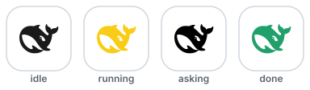

# dsh-web-icon-indicator

> 📖 [中文文档](README.zh.md) · [English](README.md)

Browser tab favicon reflects the current DSH session state — `idle` / `running` / `asking` / `done` — so you can see at a glance whether a session needs your attention, even when the tab is in the background.

## ✨ What it does

- **Live session state on the tab favicon** — the browser-tab icon mirrors `idle` / `running` / `asking` / `done` (aggregate priority: `asking` > `running` > `done` > `idle`), so background tabs tell you at a glance what your agents are doing — including `ask_user_question` prompts and approval / sandbox-escalation waits, which pin the icon to `asking`.
- **One SVG, recolored & animated in the browser** — ships a single whale template ([`icons/base.svg`](./icons/base.svg)); every state, color and frame is rendered client-side as a `data:image/svg+xml` URI. No per-color icon files.
- **Six built-in effects** — `static`, `blink`, `breath`, `rainbow`, `heartbeat`, `bounce` — all driven by JavaScript, since favicons don't play SVG CSS animations.
- **Fully configurable, applied live** — every state's color, effect and cycle speed, plus the asking/done hold timings, apply to the running tab within ~1 s — no reload, no restart.
- **Built-in settings UI, zero YAML** — a *Favicon indicator* card in the DSH settings page edits the whole config with live color-swatch previews and persists it to `settings.yaml` for you (path below).
- **Background-tab & restart-proof** — animated states keep a wall-clock fallback while `requestAnimationFrame` is paused in hidden tabs, and the status poll self-heals across host restarts.

### 🛠 Configuration UI — how to get there

| # | Step |
| --- | --- |
| 1 | Open the DSH Web GUI and go to **Settings / 设置**. |
| 2 | In the **Plugins / 插件** tab, open **Plugin config / 插件配置**. |
| 3 | Find the **Favicon indicator / 标签页图标指示器** card. |
| 4 | Expand a state row (`idle` / `running` / `asking` / `done`) to edit **Effect / 特效**, **Colors / 颜色** and **Cycle (ms) / 周期（毫秒）**; use **Asking hold / 提问驻留** and **Done hold / 完成驻留** for the two timings. |

Changes are saved through the settings transport into the profile's `settings.yaml` and applied to the running tab within ~1 s — no reload, no restart. See [Configure](#configure) for the full key reference.

## 🎬 Default configuration, visualized

The four default states, exactly as they appear in the browser tab (the `asking` whale really blinks):

<p align="center">
  
</p>

| State | Default color | Default effect |
| --- | --- | --- |
| `idle` | `#1a1a1a` — deep whale | `static` |
| `running` | `#FACC15` — yellow | `static` |
| `asking` | `#E5484D` ⇄ `#FACC15` — red/yellow | `blink` (400 ms) |
| `done` | `#22A06B` — green | `static`, stays `doneHoldMs`, then back to `idle` |

## ✨ All effects, animated

Every preview below is the real whale path, animated the same way the plugin renders it (the previews are self-contained animated SVGs — they play right in your browser):

| Effect | What it does | Preview |
| --- | --- | --- |
| `static` | A single colored frame, no motion — uses `colors[0]` |  |
| `blink` | Toggles `colors[0]` ⇄ `colors[1]` (a darker second color is derived if missing) over `speed` |  |
| `breath` | Pulsates smoothly between `colors[0]` and `colors[1]` (derived if missing) over `speed` |  |
| `rainbow` | Uses `colors[0]` as the starting hue, then cycles the color wheel over `speed` |  |
| `heartbeat` | Scale pulses with a sharp lub-dub beat over `speed` — color is `colors[0]` |  |
| `bounce` | The whale hops up and down over `speed` — color is `colors[0]` |  |

Want to tweak colors and watch the tab favicon change live? Open the self-contained demo ([`demo/dynamic-color.html`](./demo/dynamic-color.html)) — pick a state + effect, edit colors, and the favicon updates in real time (no build, no dependencies).

## Install

This is a standard DSH bundle plugin. Install it into the `web` profile (the GUI/TUI profiles pick it up automatically through the cordis patch layer).

From npm (**recommended** — published as `dsh-web-icon-indicator@0.2.1`):

```bash
dsh plugin --profile web add dsh-web-icon-indicator
```

From the Git source:

```bash
dsh plugin --profile web add github:waknow/dsh-web-icon-indicator
```

Or from a local directory / tarball:

```bash
dsh plugin --profile web add <path-or-tarball>
```

Or drop the directory into `~/.dsh/profiles/web/node_modules/<name>/` and ship a `cordis.patch.yml` that matches the one shipped here.

## Configure

All keys are optional; defaults shown.

| Key | Default | Meaning |
| --- | --- | --- |
| `iconsDir` | `<package>/icons/` | Directory holding the single `base.svg` |
| `statusPath` | `/dsh-web-icon-status.json` | JSON status endpoint |
| `iconPathPrefix` | `/dsh-web-icon-indicator` | URL prefix `base.svg` is served under |
| `askingHoldMs` | `3500` | Minimum visibility of the asking state |
| `doneHoldMs` | `5000` | Time the done state stays before falling back to idle |
| `states` | see below | Per-state visual config |

Each entry in `states` is one object per state: `{ effect, colors[], speed? }`:

```yaml
config:
  states:
    idle:    { effect: static,    colors: ['#1a1a1a'] }
    running: { effect: static,    colors: ['#FACC15'] }
    asking:  { effect: blink,     colors: ['#E5484D', '#FACC15'], speed: 400 }
    done:    { effect: static,    colors: ['#22A06B'] }
```

- **`effect`** — one of `static | blink | breath | rainbow | heartbeat | bounce`.
- **`colors`** — an **array** of hex colors. `colors[0]` is the primary. Multi-color effects read more entries: `blink` uses `colors[0]`⇄`colors[1]`, `breath` breathes `colors[0]`⇄`colors[1]` (each derives a darker second color if omitted), `rainbow` uses only `colors[0]` as the starting hue.
- **`speed`** — optional per-state cycle length in ms (also the `blink` toggle interval). Default `1200`.

Entries are shallow-merged over the defaults, so you can override only a few states. Example:

```yaml
- id: dsh-web-icon-indicator
  name: 'dsh-web-icon-indicator'
  config:
    states:
      running: { effect: breath,    colors: ['#FF9900', '#FFD9A0'], speed: 900 }
      asking:  { effect: rainbow,   colors: ['#FF0000'] }
      done:    { effect: heartbeat, colors: ['#2ECC71'] }
```

### Settings page & `settings.yaml` (DSH ≥ rc7)

The plugin registers the whole config surface above with the DSH settings
service under the `web-icon-indicator` namespace (a schemastery schema in
`lib/index.js`):

- **Web GUI:** open **设置 → 插件 → 插件配置** — a *Favicon indicator* card
  edits the same keys (asking/done hold, and per-state effect / colors /
  cycle), staged and saved through the settings transport. Each state is a
  collapsible row showing a color dot and a one-line summary (`blink ·
  #E5484D ⇄ #FACC15 · 400ms`); expanding a row reveals its three fields, and
  the colors field previews parsed swatches live.
- **Persistence:** values land in the profile's `settings.yaml` (default
  `~/.dsh/settings.yaml`) as a `web-icon-indicator:` section. The composition
  entry stays the `base` layer; resolution order is schema defaults →
  composition entry → settings document user layer.
- **No server restart, no tab reload** for settings-card saves: `askingHoldMs` /
  `doneHoldMs` apply live host-side, and per-state visual config (effect /
  colors / cycle) is synced into the running tab through the status poll within
  ~1 s. Only code-level default changes in `lib/index.js` need a tab reload (or
  a DSH web rebuild).
- The browser half is a hand-written `lib/client.js` (ModuleLoader factory
  format — no build step, no runtime deps beyond the shell's `react`). The DSH
  client scanner picks a new `dsh.client` declaration up on the next profile
  start.
- Deployments without a settings service are unaffected: the plugin falls back
  to reading the composition entry exactly as before.

## How it works

- Host plugin with a small browser half: registers routes on the existing `webServer` — the status JSON endpoint, a static `/dsh-web-icon-indicator/base.svg` (the whale template), and one `tapIndex` that injects a small browser script into every served `index.html`. The config surface is registered with the DSH settings service (`web-icon-indicator` namespace) for validation, persistence, and the settings-page card (see above).
- Status is aggregated across live `agents.list()` with priority `asking > running > done > idle`. The aggregation runs a `reconcile()` step on every request to detect running → idle transitions, because `agent/status`'s idle delivery is not guaranteed at turn end.
- `ask_user_question` tool calls (via `tools/pre-execute` / `tools/result`) flip the session into `asking` with a configurable minimum-hold so the icon stays visible even when the user answers immediately.
- Permission / **sandbox-interception** waits are also surfaced as `asking`: when the agent hits a sandbox denial and escalates (`sandbox_permissions` + `justification`), or any other tool asks for approval, the approval service appends an `approval/asked` session event and blocks the agent until you decide. The plugin watches `session/event` (with an authoritative fold over the live session log as a fallback) and pins the session into the `asking` state for that whole wait, clearing it on `approval/decided`.
- The browser script polls `/dsh-web-icon-status.json` once a second, fetches `base.svg` once, and then on every `requestAnimationFrame` tick rebuilds the favicon as a `data:image/svg+xml,…` URI — replacing the `__COLOR__` placeholder with the state's configured color and applying the state's configured effect. The status response also echoes the current per-state visual config, so a settings save reaches the running tab on the next poll (~1 s) without a reload. Browsers don't play favicon SVG CSS animations, so all motion is JS-driven. Because browsers pause `requestAnimationFrame` in hidden tabs, the poll also repaints a wall-clock frame for animated states, so background tabs keep animating (coarsely) instead of freezing; full-speed animation resumes when the tab is visible again. The poll also survives host restarts: a transient fetch failure restores the original icon and retries on the next tick (the SPA reconnects in place, so the icon comes back without a manual refresh).

## Caveats

- Favicon SVG CSS animations do not run inside the browser's tab UI — all effects are produced in JavaScript by rebuilding the data-URI each frame. This is a deliberate, zero-dependency design. (The animated previews in this README are demo assets for illustration only — the favicon itself is JS-animated.)
- The base template must keep its `__COLOR__` placeholder in the `#p { fill: … }` rule; the browser replaces that token to color each frame.
- The plugin runs in the **host** plane; it must be mounted into a profile's composition, not a session-scoped agent preset.
- File reads go through the `fs` service with the configured `iconsDir` as `cwd`. Make sure that path is readable under your deployment's sandbox policy.

## License

MIT
