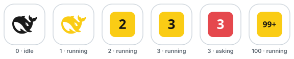

# dsh-web-icon-indicator

> 📖 [中文文档](README.zh.md) · [English](README.md) · 📝 [Changelog](CHANGELOG.md) · [Releases](https://github.com/waknow/dsh-web-icon-indicator/releases) · 🎨 [Live demo](https://waknow.github.io/dsh-web-icon-indicator/)

[](https://github.com/awesome-dsh-plugin/awesome-dsh-plugin)
[](https://www.npmjs.com/package/dsh-web-icon-indicator)
[](https://www.npmjs.com/package/dsh-web-icon-indicator)
[](./LICENSE)

> **⚠️ DSH version support** — requires **DSH ≥ 0.1.2-rc.1**. One bundle serves both settings generations: **modern** (≥ 0.1.7-alpha.1: exported `Config` schema + `configForms` + `plugins.row.config`) and **legacy** (≤ 0.1.6-alpha.1: `settings.installSection` + `settingsScope` + `settings.plugin.item`). Verified on **DSH 0.1.5-rc.3** and **DSH 0.1.7-alpha.1**; on any older host the favicon still works even if the settings page is not reachable.

Browser tab favicon reflects the current DSH session state — `idle` / `running` / `asking` / `done` — so you can see at a glance whether a session needs your attention, even when the tab is in the background.

> 🎨 **Live demo** — <https://waknow.github.io/dsh-web-icon-indicator/> · see the four states, the multi-agent counter and every effect rendered live in your browser, no install needed. The playground even drives the demo page's own tab favicon, exactly like the plugin does on a DSH page.

## ✨ What it does

- **Live session state on the tab favicon** — the browser-tab icon mirrors `idle` / `running` / `asking` / `done` (aggregate priority: `asking` > `running` > `done` > `idle`), so background tabs tell you at a glance what your agents are doing — including `ask_user_question` prompts and approval / sandbox-escalation waits, which pin the icon to `asking`.
- **One SVG, recolored & animated in the browser** — ships a single whale template ([`icons/base.svg`](./icons/base.svg)); every state, color and frame is rendered client-side as a `data:image/svg+xml` URI. No per-color icon files.
- **Six built-in effects** — `static`, `blink`, `breath`, `rainbow`, `heartbeat`, `bounce` — all driven by JavaScript, since favicons don't play SVG CSS animations.
- **Fully configurable, applied live** — every state's color, effect and cycle speed, plus the asking/done hold timings, apply to the running tab within ~1 s — no reload, no restart.
- **Built-in settings UI, zero YAML** — the *Favicon indicator* page edits the whole config with live color-swatch previews and persists it for you (modern hosts: the profile patch; legacy hosts: the profile `settings.yaml` — paths below).
- **Background-tab & restart-proof** — animated states keep a wall-clock fallback while `requestAnimationFrame` is paused in hidden tabs, and the status poll self-heals across host restarts. Returning to a tab repaints immediately: a `visibilitychange` listener fires an instant status fetch, so a state that flipped while the tab was hidden (e.g. the `done` hold expiring) shows at once instead of waiting for the next — possibly throttled — poll tick. When the backend is stopped, the tab never loses its icon: the outage restores the shell's own favicon from an offline-safe `data:`-URI copy (or keeps the last painted frame), and the live icon returns on the first successful poll.
- **Active-agent count at a glance** — while **more than one** agent is active (non-idle: `asking` / `running` / `done`), the favicon switches from the whale to a **full-frame number block** showing the live count (up to `99+`), colored and animated exactly like the whale would be in that state; back to the whale when 0–1 agents are active. (Same visual language as the *满幅数字* channel in [`demo/badge.html`](./demo/badge.html).)

### 🛠 Configuration UI — how to get there

| # | Step |
| --- | --- |
| 1 | Open the DSH Web GUI and go to **Settings / 设置** → **Plugins / 插件**. |
| 2 | On ≥ 0.1.7: open the **dsh-web-icon-indicator** bundle and click **Configure / 配置** on its `dsh-web-icon-indicator` row. On ≤ 0.1.6-alpha.1: open **Plugin config / 插件配置** in that tab. |
| 3 | The **Favicon indicator / 标签页图标指示器** page opens with the full form. |
| 4 | Set **Default icon color / 默认图标颜色** for the idle whale (its only knob — idle paints one color and never animates), then expand a state row (`running` / `asking` / `done`) to edit **Effect / 特效**, **Colors / 颜色** (each swatch is a native color picker) and **Cycle (ms) / 周期（毫秒）** (shown only for animated states — static states have no cycle); use **Asking hold / 提问驻留** and **Done hold / 完成驻留** for the two timings. |

Changes are saved through the settings transport into the profile patch and applied to the running tab within ~1 s — no reload, no restart. See [Configure](#configure) for the full key reference.

## 🎬 Default configuration, visualized

The four default states, exactly as they appear in the browser tab (the `asking` whale really blinks):

<p align="center">
  
</p>

| State | Default color | Default effect |
| --- | --- | --- |
| `idle` | `#1a1a1a` — deep whale (replaceable with `defaultColor`) | `static` |
| `running` | `#FACC15` — yellow | `static` |
| `asking` | `#E5484D` ⇄ `#FACC15` — red/yellow | `blink` (400 ms) |
| `done` | `#22A06B` — green | `static`, stays `doneHoldMs`, then back to `idle` |

### Multi-agent, visualized

With several agents running at once, the favicon itself becomes the counter:
while **more than one** agent is active (non-idle: `asking` / `running` / `done`,
including the short `done` hold), the whale is replaced by a full-frame count
block showing the live `active` count, filled with the aggregate state's color
and driven by the same effect — so it keeps blinking / breathing / cycling
exactly like the whale would. With 0–1 active agents it comes right back to
the whale.

<p align="center">
  
</p>

| `active` (non-idle agents) | Favicon |
| --- | --- |
| `0` | dark `idle` whale |
| `1` | that state's whale (`running` yellow, …) |
| `2`–`99` | full-frame count block; digit height ≈31–52% of the icon (1 digit = 26, 2 = 20, 3+ = 15.5), readable at 16px and in pinned tabs |
| `100`+ | `99+` |

State priority is unchanged, so `asking` still takes over with its red ⇄ yellow
400 ms blink (the count block blinks), `done` flashes its color for
`doneHoldMs`, and the count refreshes live through the status poll (~1 s).
Same visual language as the *满幅数字* channel of
[`demo/badge.html`](./demo/badge.html).

## ✨ All effects, animated

Every preview below is the real whale path, animated the same way the plugin renders it (the previews are self-contained animated SVGs — they play right in your browser):

| Effect | What it does | Preview |
| --- | --- | --- |
| `static` | A single colored frame, no motion — uses `colors[0]` |  |
| `blink` | Toggles `colors[0]` ⇄ `colors[1]` (a darker second color is derived if missing) over `speed` |  |
| `breath` | Pulsates smoothly between `colors[0]` and `colors[1]` (derived if missing) over `speed` |  |
| `rainbow` | Uses `colors[0]` as the starting hue, then cycles the color wheel over `speed` |  |
| `heartbeat` | Scale pulses with a sharp lub-dub beat over `speed` — color is `colors[0]` |  |
| `bounce` | The whale hops up and down over `speed` — color is `colors[0]` |  |

Want to tweak colors and watch the tab favicon change live? Open the self-contained demo ([`demo/dynamic-color.html`](./demo/dynamic-color.html)) — pick a state + effect, edit colors, and the favicon updates in real time (no build, no dependencies).

## Install

This is a standard DSH bundle plugin. Install it into the `web` profile (the GUI/TUI profiles pick it up automatically through the cordis patch layer).

From npm (**recommended**):

```bash
dsh plugin --profile web add dsh-web-icon-indicator@latest
```

From the Git source:

```bash
dsh plugin --profile web add github:waknow/dsh-web-icon-indicator
```

Or from a local directory / tarball:

```bash
dsh plugin --profile web add <path-or-tarball>
```

Or drop the directory into `~/.dsh/profiles/web/node_modules/<name>/` and ship a `cordis.patch.yml` that matches the one shipped here.

## Configure

All keys are optional; defaults shown. `statusPath` and `iconPathPrefix` are
**registration-time** keys: set them in the composition entry only — they are
baked into the route table and the injected script when the plugin mounts, so
they are intentionally **not** part of the settings page's live form (they are
`Config` fields, but not `.volatile()`).

| Key | Default | Meaning |
| --- | --- | --- |
| `iconsDir` | `<package>/icons/` | Directory holding the single `base.svg` |
| `statusPath` | `/dsh-web-icon-status.json` | JSON status endpoint — **registration-time (composition entry only)** |
| `iconPathPrefix` | `/dsh-web-icon-indicator` | URL prefix `base.svg` is served under — **registration-time (composition entry only)** |
| `askingHoldMs` | `3500` | Minimum visibility of the asking state |
| `doneHoldMs` | `5000` | Time the done state stays before falling back to idle |
| `defaultColor` | *(unset)* | Default icon color (the idle whale's primary) — tell multiple DSH instances apart. Warns when it is too close to another state's color |
| `states` | see below | Per-state visual config |

Each entry in `states` is one object per state: `{ effect, colors[], speed? }`:

```yaml
config:
  states:
    idle:    { effect: static,    colors: ['#1a1a1a'] }
    running: { effect: static,    colors: ['#FACC15'] }
    asking:  { effect: blink,     colors: ['#E5484D', '#FACC15'], speed: 400 }
    done:    { effect: static,    colors: ['#22A06B'] }
```

- **`effect`** — one of `static | blink | breath | rainbow | heartbeat | bounce`.
- **`colors`** — an **array** of hex colors (`#rgb` / `#rrggbb`; a malformed entry is ignored, and the state's built-in colour applies when none survives). `colors[0]` is the primary. Multi-color effects read more entries: `blink` uses `colors[0]`⇄`colors[1]`, `breath` breathes `colors[0]`⇄`colors[1]` (each derives a darker second color if omitted), `rainbow` uses only `colors[0]` as the starting hue.
- **`speed`** — optional per-state cycle length in ms (also the `blink` toggle interval). Default `1200`.

`idle` is special: its color is the `defaultColor` key, and the settings card
offers **no per-state entry** for it (one color, no animation, no cycle). A
`states.idle` entry is still honored when it arrives from the composition entry
or the settings document's user layer — backward compatibility only; it is
simply not editable from the page.

Entries are shallow-merged over the defaults, so you can override only a few states. Example:

```yaml
- id: dsh-web-icon-indicator
  name: 'dsh-web-icon-indicator'
  config:
    states:
      running: { effect: breath,    colors: ['#FF9900', '#FFD9A0'], speed: 900 }
      asking:  { effect: rainbow,   colors: ['#FF0000'] }
      done:    { effect: heartbeat, colors: ['#2ECC71'] }
```

### Tell multiple instances apart (`defaultColor`)

Running several DSH instances at once (different projects, profiles or ports)?
Give each one its own default icon color and the browser tabs become
immediately distinguishable — no need to touch the per-state palette:

```yaml
- id: dsh-web-icon-indicator
  name: 'dsh-web-icon-indicator'
  config:
    defaultColor: '#5B8DEF'
```

- `defaultColor` is the **idle whale's primary color**. It is folded into
  `states.idle.colors[0]`, so the idle state keeps its effect and any second
  color you configured; the other states keep their signal colors. Unset (the
  default) means "the idle state's own color", i.e. today's behavior.
- It is a **per-DSH-instance** setting, not per browser tab: every tab of one
  instance shares it, while another instance (its own profile, e.g.
  `dsh web --port 3081`) can use a different color.
- **Reset** removes your overrides back to the composition entry. When the
  color comes from that entry (the `base` layer, which an `unset` cannot
  reach), the card writes the idle state's own color instead — so "Reset to
  defaults" really returns the icon to the plain whale color, and the entry's
  value stays reachable through the clear-override control.
- **Similarity warning.** When the default color is perceptually too close to
  another state's color you get a warning — live in the settings card, in the
  host log, and as `warnings` on the status endpoint — but the value is still
  applied (the warning never blocks saving). Distance is **CIE76 ΔE in
  CIELAB**: `ΔE < 25` warns, `ΔE < 12` is reported as nearly identical
  (`ΔE 2.3` is the just-noticeable difference). Every fill a state actually
  paints is considered: the `asking` blink covers both of its colors,
  `breath` its interpolation, and a `rainbow` state is flagged for any
  chromatic default because it sweeps every hue. The shipped `running` and
  `asking` colors deliberately share `#FACC15`, so states are never compared
  with each other — only the default color against them. A malformed value is
  ignored (and reported) rather than painted.

### Settings page (DSH ≥ 0.1.2-rc.1, both settings generations)

The plugin exports the whole config surface above as its Cordis `Config`
schema (a schemastery schema in `lib/index.js`) **and** registers the same
schema through the legacy settings service when the running host still exposes
it — the two paths are feature-detected at mount, so one bundle serves both.
The namespace differs by generation: **≥ 0.1.7** keys every live form by
**profile entry id**, so it is `dsh-web-icon-indicator` (the row id the bundle
patch declares); **≤ 0.1.6-alpha.1** uses the plugin-chosen
`web-icon-indicator`, the same string 0.5.x used, so an existing section keeps
resolving:

- **Web GUI:** open **设置 → 插件**, expand the **dsh-web-icon-indicator**
  bundle and configure its row. The *Favicon indicator* page edits the same
  keys: asking/done hold, the **default icon color** (with a
  live palette preview and the similarity warning), and the per-state effect /
  colors / cycle for `running` / `asking` / `done`. Each of those states is a
  collapsible row whose header shows one **color chip** per state — split in two
  for a multi-color state, so `asking` shows red | yellow at a glance — plus a
  one-line summary of the effect and cycle (`Blink · 400ms`). Clicking a chip
  opens the native color picker, which is where the hex value is shown/typed;
  the card prints no colour codes itself, except in the similarity warning,
  which names the offending hex to be actionable (e.g. `… Running color #FACC15
  (ΔE 0)`). The expanded row lists one chip per
  color the chosen effect actually uses: `blink` / `breath` get a `+` chip while
  there is still room for a second color (it opens on the darker shade the
  browser would derive anyway, and never appends a color the state already has),
  every color after the first can be removed, and a single-color effect shows —
  and saves — only one chip, so an unused second color can never linger
  invisibly. `rainbow` carries no color list: its field and its chip show the
  hue wheel, next to an optional chip for the **starting hue** (the stored
  `colors[0]`). `idle` deliberately gets **no row** — it paints one
  color and never animates, so the default-color field is its whole
  configuration. Everything is staged and saved through the settings transport.
- **Persistence:** on ≥ 0.1.7 values land in the profile patch
  (`~/.dsh/profiles/<profile>/cordis.patch.yml`) under the
  `dsh-web-icon-indicator` row's `config:` block; on ≤ 0.1.6-alpha.1 they land
  in `~/.dsh/settings.yaml` as a `web-icon-indicator:` section. In both cases
  the composition entry stays the `base` layer; resolution order is schema
  defaults → composition entry → user layer.
- **No server restart, no tab reload** for settings-page saves. On ≥ 0.1.7 a
  live write is committed into the running plugin's config references
  (`loader/volatile-update` — the loader does not restart the plugin); on the
  legacy line the service calls the registered `onChange` hook. Either way
  `askingHoldMs` / `doneHoldMs` apply host-side immediately and per-state visual
  config (effect / colors / cycle) is synced into the running tab through the
  status poll within ~1 s. Only code-level default changes in `lib/index.js`
  need a tab reload (or a DSH web rebuild).
- **Route paths are not live settings.** `statusPath` / `iconPathPrefix` are
  validated by `Config` but deliberately **not** `.volatile()`, so they are
  absent from the live form: they are baked into the route table and the
  injected script at registration time, and honoring an edit there would point
  the browser at a path the server never serves. They are composition-entry
  only (see the table above); changing them re-applies the plugin.
- The live surface therefore covers `askingHoldMs`, `doneHoldMs`, `iconsDir`,
  `defaultColor` and `states`. `iconsDir` has no schema default, so it is
  omitted from the resolved form until a user sets it.
- The browser half is a hand-written `lib/client.js` (ModuleLoader factory
  format — no build step, no runtime deps beyond the shell's `react`). It
  registers on both page slots (`plugins.row.config` — gated on the served
  namespace — and the legacy `settings.plugin.item`) and resolves whichever
  settings provider the host exposes (`configForms` or `settingsScope`) at
  render time, so neither is a hard dependency of the module. The DSH client
  scanner picks a new `dsh.client` declaration up on the next profile start.
- Deployments without a settings service are unaffected: the plugin keeps
  running on the composition entry + schema defaults it was mounted with.

## How it works

- Host plugin with a small browser half: registers routes on the existing `webServer` — the status JSON endpoint, a static `/dsh-web-icon-indicator/base.svg` (the whale template), and one `tapIndex` that injects a small browser script into every served `index.html`. The config surface is the plugin's exported `Config` schema, which the DSH settings service projects into a live page keyed by the `dsh-web-icon-indicator` entry id (see above).
- Status is aggregated across live `agents.list()` with priority `asking > running > done > idle`. The aggregation runs a `reconcile()` step on every request to detect running → idle transitions, because `agent/status`'s idle delivery is not guaranteed at turn end. The status endpoint also reports `active` — the number of non-idle agents — and while that count is **> 1** the injected script renders a full-frame count block (the *满幅数字* channel of [`demo/badge.html`](./demo/badge.html): a rounded block filled with the same per-frame state color/effect as the whale, bold white count sized 31%–52% of the icon, capped at `99+`) instead of the whale, so the tab shows how many agents are busy at once even in a pinned 16px tab.
- `ask_user_question` tool calls (via `tools/pre-execute` / `tools/result`) flip the session into `asking` with a configurable minimum-hold so the icon stays visible even when the user answers immediately.
- Permission / **sandbox-interception** waits are also surfaced as `asking`: when the agent hits a sandbox denial and escalates (`sandbox_permissions` + `justification`), or any other tool asks for approval, the approval service appends an `approval/asked` session event and blocks the agent until you decide. The plugin watches `session/event` (with an authoritative fold over the live session log as a fallback) and pins the session into the `asking` state for that whole wait, clearing it on `approval/decided`.
- The browser script polls `/dsh-web-icon-status.json` once a second (the interval is fixed at 1000 ms in the injected script — it is not a config key), fetches `base.svg` once, and then on every `requestAnimationFrame` tick rebuilds the favicon as a `data:image/svg+xml,…` URI — replacing the `__COLOR__` placeholder with the state's configured color and applying the state's configured effect. The status response also echoes the current per-state visual config, so a settings save reaches the running tab on the next poll (~1 s) without a reload. Browsers don't play favicon SVG CSS animations, so all motion is JS-driven. Because browsers pause `requestAnimationFrame` in hidden tabs, the poll also repaints a wall-clock frame for animated states, so background tabs keep animating (coarsely) instead of freezing; full-speed animation resumes when the tab is visible again. Returning to a tab also triggers an immediate status fetch and repaint (`visibilitychange`), so a state that flipped while the tab was hidden shows at once instead of on the next — possibly throttled — poll tick. The poll also survives host restarts — and a stopped backend never blanks the tab: at startup the script caches an offline-safe `data:`-URI copy of the original favicon, and on a fetch failure it restores that copy (or, if none could be captured, keeps the last painted frame) — it never writes the original server URL back, which would be unreachable exactly while the host is down. It retries every tick, and the live icon returns on the first successful poll (the SPA reconnects in place, so no manual refresh is needed).

## Browser support & known limitations

The favicon is a plain image, so browsers never run the SVG's own CSS/JS animation inside the tab UI — every frame is rendered here in JavaScript. How well a *changing* favicon is displayed differs by browser:

| Browser | SVG favicon | Live per-state color/effect | Why |
| --- | --- | --- | --- |
| Chrome / Edge | ✅ | ✅ smooth | Re-reads `<link rel=icon>` live; `data:`-URI SVGs are fine. |
| Firefox | ✅ | ✅ smooth | Renders SVG favicons well (and honors their `prefers-color-scheme`, unused here). |
| Safari (macOS) | ✅ rendered static | ⚠️ best-effort | Ignores in-SVG CSS; aggressive icon caching. |
| Safari (iOS) | ✅ rendered static | ⚠️ rarely | Unlikely to refresh without revisiting the tab. |

Known limitations (current as of Safari 26.3):

- **Favicons have their own cache.** Chrome keeps a favicon database, Firefox a `favicons.sqlite`, and **Safari a system-level icon cache** — none of which a normal *clear cache* touches, and WebKit even caches the "no icon" case. That is why a changed icon can linger for an existing tab. The plugin already mitigates this: it serves `base.svg` and the status endpoint with `Cache-Control: no-store`, bundles a freshness query (`?t=Date.now()`) on its fetches, and replaces the `<link rel=icon>` node on each state change.
- **Safari renders SVG favicons but ignores their internal CSS** — no `@media`, no `prefers-color-scheme`, no CSS animation. So all recoloring must be baked into each frame's markup (which the plugin does) rather than driven by CSS variables.
- **`data:`-URI SVG favicons are unreliable in Safari** (WebKit bug 236616, still open; reproduced on Safari 17.6). The plugin currently builds each frame as a `data:image/svg+xml` URI, so on Safari the tab icon may not render at all — the biggest known gap.
- **Dynamic JS updates in Safari are hit-or-miss;** they may require a reload, and Safari "locks onto" the first icon it sees. There is no guaranteed, spec-supported way to swap a favicon live in Safari today.
- **Pinned-tab icon (`<link rel="mask-icon">`) uses its own cache**, separate from the regular favicon, and is a single-colour silhouette tinted by the `color` attribute — macOS + pinned-tab only, read at page load, not live.

Full mechanics with sources (WebKit bugs, Stack Overflow, browser-engineering blogs) and a recommended path toward smoother Safari colour changes live in [`docs/safari-favicon-research.md`](./docs/safari-favicon-research.md).

## Caveats

- Favicon SVG CSS animations do not run inside the browser's tab UI — all effects are produced in JavaScript by rebuilding the data-URI each frame. This is a deliberate, zero-dependency design. (The animated previews in this README are demo assets for illustration only — the favicon itself is JS-animated.)
- Favicon behavior differs by browser, and Safari is the most limited — see [Browser support & known limitations](#browser-support--known-limitations).
- The base template must keep its `__COLOR__` placeholder in the `#p { fill: … }` rule; the browser replaces that token to color each frame.
- The plugin runs in the **host** plane; it must be mounted into a profile's composition, not a session-scoped agent preset.
- File reads go through the `fs` service with the configured `iconsDir` as `cwd`. Make sure that path is readable under your deployment's sandbox policy.

## License

MIT
